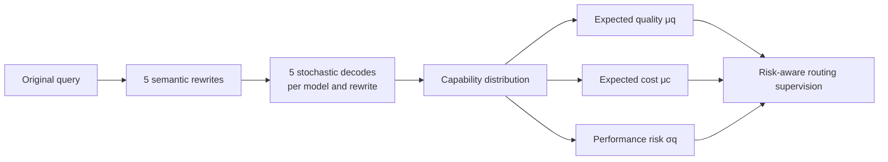

<div align="center">

# DARS

### From Sampled Outcomes to Capability Distributions: Rethinking Supervision for LLM Routing

Guannan Lai · Haoran Hu · Long Chen · Zhenguo Li · Han-Jia Ye

**Accepted at EMNLP 2026**

[](https://2026.emnlp.org/)
[](https://arxiv.org/abs/2606.06924)
[](https://huggingface.co/datasets/AIGNLAI/DARS)
[](LICENSE)

Official implementation and data for **DARS (Distribution-Aware Routing Supervision)**.

[Quick Start](#quick-start) · [Reproduce Experiments](#reproduce-the-routing-experiments) · [Build from Raw Data](#build-the-data-from-scratch) · [Citation](#citation)

</div>

---

Most LLM routers learn from a single sampled answer for every query–model pair. DARS instead estimates a **capability distribution** from meaning-preserving query rewrites and repeated stochastic generations. It turns these observations into expected quality, expected cost, and performance risk:

<div align="center">

**U(x, m) = μ<sub>q</sub>(x, m) − λ μ<sub>c</sub>(x, m) − β σ<sub>q</sub>(x, m)**

</div>

DARS changes the supervision—not the router architecture—so it can be applied to regression-, retrieval-, graph-, clustering-, representation-, causal-, and IRT-based routers.



## News

- **2026:** DARS was accepted at **EMNLP 2026**. 🎉
- **2026-06:** The paper, code, and scored routing benchmark were released.

## Quick Start

The fastest reproducible path uses the precomputed, scored generations hosted on Hugging Face. It does **not** call any paid model API.

### 1. Install

```bash
git clone https://github.com/AIGNLAI/DARS.git
cd DARS

conda create -n dars python=3.10 -y
conda activate dars
pip install -r requirements.txt
```

Python 3.10 or newer is recommended.

### 2. Download the DARS data from Hugging Face

Use the included downloader; it downloads only the scored files required by the routing experiments and verifies the resulting directory layout.

```bash
python dataset/download_hf_data.py --output-dir data
```

Equivalent Hugging Face CLI command:

```bash
hf download AIGNLAI/DARS \
  --repo-type dataset \
  --local-dir data
```

The expected layout is:

```text
data/
├── gpqa/
│   ├── train_scored_generations.jsonl
│   ├── test_scored_generations.jsonl
│   └── metadata.json
├── math-500/
│   └── ...
└── drop-800/
    └── ...
```

The hosted benchmark contains 600 training queries and 1,148 held-out test queries across three tasks:

| Dataset | Task | Train queries / rows | Test queries / rows |
|:--|:--|--:|--:|
| GPQA | Graduate-level science QA | 200 / 30,000 | 248 / 8,928 |
| MATH-500 | Mathematical reasoning | 200 / 30,000 | 300 / 10,800 |
| DROP-800 | Discrete reasoning over text | 200 / 30,000 | 600 / 21,600 |

### 3. Run an experiment

This command compares single-shot supervision with DARS using the MLP router on all datasets:

```bash
python methods/mlp.py \
  --data-dir data \
  --datasets gpqa math-500 drop-800 \
  --mode both \
  --feature-backend tfidf \
  --single-point-runs 100 \
  --output-dir outputs/mlp
```

`--mode both` runs the two supervision settings with the same router implementation:

- `single-point`: one randomly sampled observation per query–model pair, averaged over `--single-point-runs` routers;
- `distribution`: DARS supervision using mean quality, mean cost, and quality variability.

For a quick CPU smoke test, reduce the scope and repetitions:

```bash
python methods/mlp.py \
  --data-dir data \
  --datasets gpqa \
  --mode both \
  --feature-backend tfidf \
  --single-point-runs 1 \
  --max-iter 20 \
  --output-dir outputs/smoke
```

The summary and per-query predictions are written as CSV files under the selected output directory.

## Reproduce the Routing Experiments

All router entry points share the important arguments `--data-dir`, `--datasets`, `--mode`, `--single-point-runs`, and `--output-dir`. Run them from the repository root.

| Router | Entry point | Main idea |
|:--|:--|:--|
| MLP | `methods/mlp.py` | Regression-based routing |
| kNNRouter | `methods/knn_router.py` | Non-parametric retrieval |
| EmbedLLM | `methods/embed_llm.py` | Model-embedding regression |
| MIRT | `methods/mirt.py` | Item-response-theory routing |
| RM-Softmax | `methods/rm_softmax.py` | Classification and regret minimization |
| GraphRouter | `methods/graph_router.py` | Query–model edge prediction |
| AvengersPro | `methods/avengers_pro.py` | Cluster-based routing |

For example:

```bash
# Retrieval-based router
python methods/knn_router.py \
  --data-dir data --mode both --feature-backend tfidf \
  --single-point-runs 100 --output-dir outputs/knn_router

# Representation-learning router (uses CUDA automatically when available)
python methods/embed_llm.py \
  --data-dir data --mode both --feature-backend tfidf \
  --single-point-runs 100 --device auto --output-dir outputs/embed_llm

# Graph-based router
python methods/graph_router.py \
  --data-dir data --mode both --feature-backend tfidf \
  --single-point-runs 100 --device auto --output-dir outputs/graph_router

# Paper's classification / regret-minimization baseline
python methods/rm_softmax.py \
  --data-dir data --mode both --feature-backend tfidf \
  --single-point-runs 100 --loss softmax --device auto \
  --output-dir outputs/rm_softmax
```

Use `python methods/<router>.py --help` for router-specific hyperparameters. The `tfidf` feature backend is self-contained and is the easiest way to reproduce the pipeline. To use sentence embeddings instead:

```bash
hf download sentence-transformers/all-MiniLM-L6-v2 \
  --local-dir models/all-MiniLM-L6-v2

python methods/mlp.py \
  --data-dir data \
  --mode both \
  --feature-backend sentence-transformer \
  --local-encoder-path models/all-MiniLM-L6-v2 \
  --output-dir outputs/mlp_minilm
```

### Experimental protocol

- **Training:** 200 queries per dataset, 5 semantic rewrites, 5 independent decodes per rewrite, and 6 candidate LLMs—150 observations per query.
- **Single-shot baseline:** one observation per query–model pair; the paper averages 100 independently sampled training sets.
- **Test:** 3 rewritten-query observations and 3 decoding-strategy observations per query–model pair.
- **Utility:** costs are normalized within each dataset; the paper defaults are `λ = 0.05` for cost and `β = 0.2` for risk.
- **Model pool:** Gemma-3-12B-IT, Mistral-Small-3.2-24B-Instruct, Qwen3-32B, Llama-3.3-70B-Instruct, Gemini-2.5-Flash-Lite, and DeepSeek-Chat-V3.1.

## Build the Data from Scratch

This route reconstructs the benchmark from the original Hugging Face datasets and calls models through OpenRouter. It incurs API cost and provider-side model updates may make newly generated outputs differ from the released snapshot. For exact router comparisons, prefer the [precomputed DARS data](#2-download-the-dars-data-from-hugging-face).

### 1. Download and normalize the source datasets

GPQA is gated on Hugging Face. Accept its access conditions first, then authenticate without placing a token in source code:

```bash
hf auth login
# Alternatively: export HF_TOKEN=hf_...

python dataset/prepare_datasets.py \
  --output_dir data \
  --datasets gpqa math-500 drop-800 \
  --train_size 200 \
  --drop_max_records 800 \
  --seed 42
```

This downloads `Idavidrein/gpqa`, `HuggingFaceH4/MATH-500`, and `ucinlp/drop`, normalizes their schemas, and creates query-level train/test splits.

### 2. Create meaning-preserving rewrites

```bash
export OPENROUTER_API_KEY=your_key_here

python dataset/rewrite_queries.py \
  --data_dir data \
  --datasets gpqa math-500 drop-800 \
  --num_variants 5 \
  --model openai/gpt-4o \
  --max_workers 8
```

### 3. Collect repeated training and test observations

```bash
python dataset/collect_train_generations.py \
  --data_dir data \
  --datasets gpqa math-500 drop-800 \
  --num_prompt_variants 5 \
  --num_decodes 5 \
  --max_workers 12

python dataset/collect_test_generations.py \
  --data_dir data \
  --datasets gpqa math-500 drop-800 \
  --num_prompt_variants 3 \
  --max_workers 12
```

The rewrite and generation scripts are resumable: after interruption, rerun the same command and completed records will be skipped. Tune worker counts to your OpenRouter rate limits.

### 4. Score generations

```bash
python dataset/score_generations.py \
  --data-dir data \
  --datasets gpqa math-500 drop-800 \
  --splits train test
```

You can now run any router command from the previous section against the reconstructed scored files.

## Code Quality Checks

The repository uses Ruff for linting and formatting, plus `unittest` regression tests for shared method behavior:

```bash
pip install -r requirements-dev.txt
ruff check methods tests dataset/download_hf_data.py
ruff format --check methods tests dataset/download_hf_data.py
python -m unittest discover -s tests -v
```

## Repository Structure

```text
DARS/
├── dataset/
│   ├── download_hf_data.py          # download the released scored benchmark
│   ├── prepare_datasets.py          # normalize original HF datasets
│   ├── rewrite_queries.py           # create semantic query variants
│   ├── collect_train_generations.py # collect 5 × 5 training observations
│   ├── collect_test_generations.py  # collect test observations
│   └── score_generations.py         # task-specific automatic scoring
├── methods/                         # seven router implementations
├── tests/                           # method and data-contract regression tests
├── pyproject.toml                   # lint and formatting configuration
├── requirements.txt
└── README.md
```

## Citation

If DARS helps your work, please cite:

```bibtex
@inproceedings{lai2026dars,
  title     = {From Sampled Outcomes to Capability Distributions: Rethinking Supervision for {LLM} Routing},
  author    = {Lai, Guannan and Hu, Haoran and Chen, Long and Li, Zhenguo and Ye, Han-Jia},
  booktitle = {Proceedings of the 2026 Conference on Empirical Methods in Natural Language Processing},
  year      = {2026}
}
```

## License

The code is released under the [MIT License](LICENSE). The released benchmark contains derived data from GPQA, MATH-500, and DROP; their original licenses and access conditions continue to apply. See the [Hugging Face dataset card](https://huggingface.co/datasets/AIGNLAI/DARS) for data details and limitations.

## Contact

For questions, please open a GitHub issue or contact [Guannan Lai](mailto:laign@lamda.nju.edu.cn).
